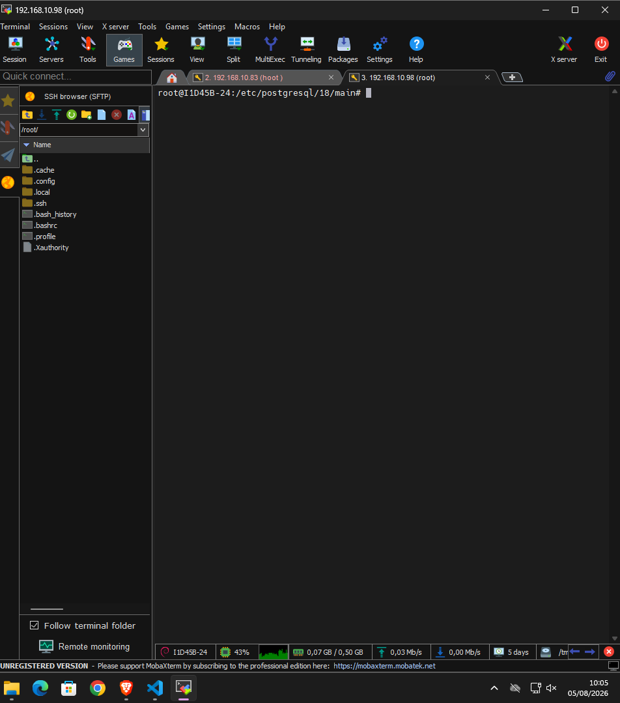

###
instalar e configurar o sgbd potreSQL

comando para instalar o SGBD:

```bash
sudo apt install -y postgresql
```
>obs o comando sudo, nosso acesso
---
realizando verificação do SGBD
```BASH
pg_lscluters
```

para realisar o acesso do SGBD **sem senha**,
ultilizar o comando:

```bash
sudo -u postgres psql
```
>com esse comando o acesso é feito sem senha, pois o linux ja provou quem você é (oot) autenticção PER.
para primeiro acesso, alterei a senha:

```sql
ALTER USER postgres PASSWORD 'hattorizxd';
```

>o retorno correto, é `ALTER ROLE`.

para sair do postgres, comando `\q` (igual o \quit de jogos comp)


---

## Configurações de serviço 
Caminho padrão para as configurações do postgres




primeira configuração:
```bash
sudo nano postgresql.conf
```
CTRL + W para bsucar a linha do listen_addresses e descomentamos, alterando para `*`.

se ficar no localhost

passo 2:para liberar o acesso de todas as maquinas seria:
```bash
sudo nano pg_ba.conf
```
nas ultimas linhas, adicionei:
host all all 10.87.38.0/24 scram-sha-256

para criar um banco de dados, usamos o comando:
```sql
CREATEDATABASE lojamax;
```
para visualisar os bancos 
```bash
\1
```

